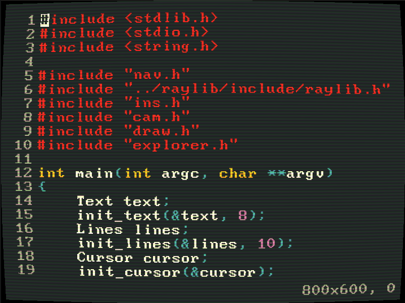

# ReD is a (work in progress) simple text editor made with raylib

Red does not have any meaning, so Raylib eDitor and other coincidences are just coincidences.

### Some sources that helped me: 

- This was inspired by: https://youtu.be/w_yXlnjeAy4
- Raylib: https://github.com/raysan5/raylib
- Nerd fonts: https://www.nerdfonts.com/ 
- Crafting interpreters book: (text tokenization) https://craftinginterpreters.com/scanning-on-demand.html
- The crt shader is inspired by this video: https://youtu.be/aWdySZ0BtJs
- The gruvbox pallete: https://github.com/morhetz/gruvbox
