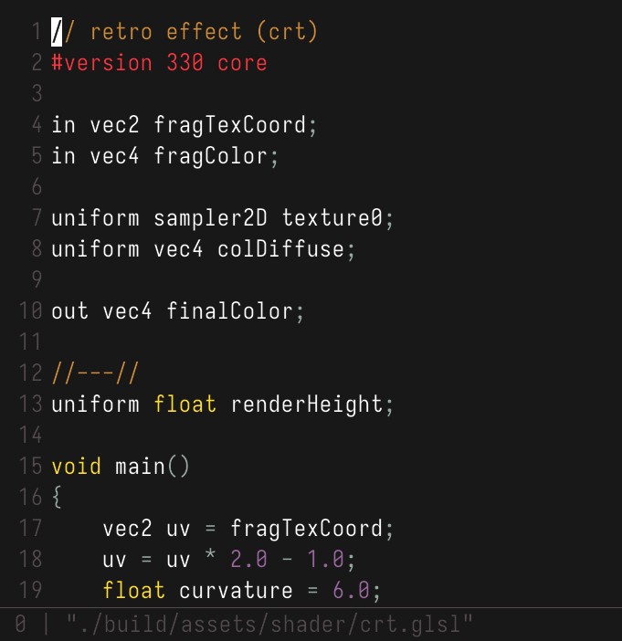

# ReD is a toy text editor made with raylib

features:
- uncommon keybinds: ctrl + ... [i j k l] for cursor movement, ...[w a s d] for going top, start of line, botton, end of file
- common keybinds: ctrl + f, z/y
- can render shaders
- syntax hightlighting: hardcoded c mode, the one and only
- toy thex editor
- only works with monospaced fonts

### Dependencies:
- Raylib: https://github.com/raysan5/raylib
- Nerd fonts: https://www.nerdfonts.com/ (a monospace font is mandatory in order for the drawing to be consistent)

### Building:
See the `build.sh` script.

### Some resources: 
- Project inspired by: https://youtu.be/w_yXlnjeAy4
- Crafting interpreters book: (text tokenization) https://craftinginterpreters.com/scanning-on-demand.html
- The crt shader was inspired by this video: https://youtu.be/aWdySZ0BtJs

### Missing features:
- Undo/Redo
- Multiple language syntax support
- Still bugs when loading some files
