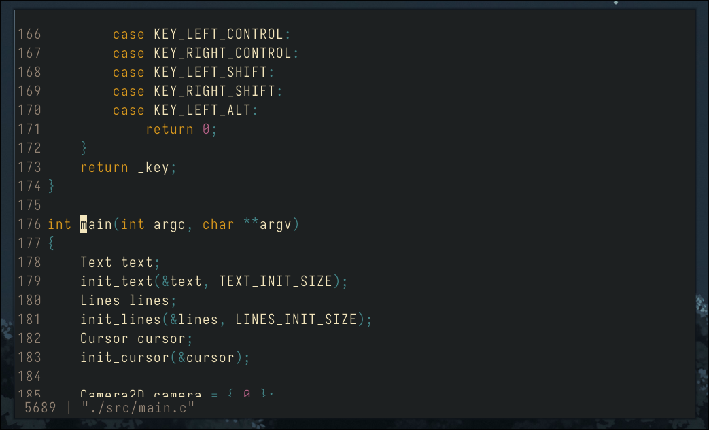

# ReD is a (work in progress) simple text editor made with raylib

ReD does not have any real meaning (Raylib eDitor and others are just coincidences).
The editor only have a C mode for drawing colored text.

### Dependencies:
- Raylib: https://github.com/raysan5/raylib
- Nerd fonts: https://www.nerdfonts.com/ (a monospace font is mandatory in order for the drawing to be consistent)

### Building:

Take a look at the `build.sh` script.

### Some resources: 
- Project inspired by: https://youtu.be/w_yXlnjeAy4
- Crafting interpreters book: (text tokenization) https://craftinginterpreters.com/scanning-on-demand.html
- The crt shader was inspired by this video: https://youtu.be/aWdySZ0BtJs

